# NOTE_KEEPER_APPLICATION :star_struck: :memo: :iphone: :notebook: :notebook_with_decorative_cover:

[](https://shields.io/) [](https://shields.io/) [](https://shields.io/) [](https://shields.io/) [](https://shields.io/) [](https://shields.io/) [](https://shields.io/) [](https://shields.io/) [](https://shields.io/) [](https://shields.io/) [](https://shields.io/) [](https://shields.io/) [](https://shields.io/)

***This new flutter application 'Note-Keeperis created by Biswarup Bhattacharjee, student of BTECH, in University of Engineering and Management, Kolkata.***

**Email Id: bbiswa471@gmail.com.** 

**Contact No: 916290272740.** 


<p align="left">
<a href="https://www.facebook.com/profile.php?id=100070395300810" target="blank"></a>
<a href="https://instagram.com/biswarup2210" target="blank"></a>
<a href="https://github.com/biswa2210/biswa2210" target="blank"></a>
</p>

## About :point_down: 

<div align="justified">
     
It is a flutter application named ‘Note Keeper’. This Note Keeper is a simple application which manages user’s notes. User can save, edit or delete notes. When there is nothing kept it shows a sad face. User can add notes using the plus sign. Then he can add description. He can also set priority level. Like if it is very important he can set ‘High’ and it is less important he can set ‘Low’. He can edit anything later in a note as he wants. Here user can also see the date when he has taken the note. It is very simple, user friendly and safe place to keep our notes. Note-taking (sometimes written as notetaking or note taking) is the practice of recording information from different sources and platforms. By taking notes, the writer records the essence of the information, freeing their mind from having to recall everything. Notes are commonly drawn from a transient source, such as an oral discussion at a meeting, or a lecture (notes of a meeting are usually called minutes), in which case the notes may be the only record of the event. Note taking is a very common and useful work for any kind of study, research etc. Students, officers or anyone prefers note keeping. It is fully responsive means when we change the orientation of our android or iphone the app fits perfectly. This appliaction is fully responsive. It can work properly in landscape or portrait mode according to user.
</div>

## We can add for each note :point_down:

 - title
 - description
 - priority
 
## APP DOWNLOAD LINK : :point_right: <a href="https://github.com/biswa2210/note_keeper_application/raw/master/Note_Keeper_base.apk" download>Click here to download</a>

## Purpose :point_down:

I have made this for keeping important notes safely. Students, Officers, businessmen or anyone can keep their notes in this app.

## Use :point_down:

User just has to add notes. He can edit, delete notes whenever he wants. He can set priority, title and description of a note.

## Importance :point_down:

Everyone knows the importance of note keeping. We can keep our personal informations here, this makes it an important app. In digital world everyone prefers to keep note in a safe app.

## Folder Structure :point_down:

```bash
note_keeper_application
     ├── assets 
     |     ├── fonts
     |     |     └── CB.ttf
     |     └── images
     |           ├── sadface.png
     |           ├── spsc.jpg
     |           └── spsc.png
     └── lib
           ├── models
           |     └── Node.dart
           ├── screens
           |     ├── note_detail.dart
           |     └── note_list.dart
           ├── utils
           |     └── database_helper.dart
           ├── home.dart
           └── main.dart
 ```                      
## Making :point_down:

This flutter application is totally responsive. When we change the orientation the app fits in that. I have used [FLUTTER](https://flutter.dev/?gclid=Cj0KCQjw38-DBhDpARIsADJ3kjliHdMH2hA97bBGqJtW5ORUUksCxpZ8cnrSWaH__HevGftAmP8AmvIaAhNlEALw_wcB&gclsrc=aw.ds) and [Dart](https://dart.dev/) in front end and backend. I have designed this using [Materials ui](https://material-ui.com/). I have created database using [sql](https://en.wikipedia.org/wiki/SQL) where the notes are kept in table. I have loaded the entire app in main.dart.

## Getting Started :point_down: 

This project is a starting point for a Flutter application.

A few resources to get you started if this is your first Flutter project:

- [Lab: Write your first Flutter app](https://flutter.dev/docs/get-started/codelab)
- [Cookbook: Useful Flutter samples](https://flutter.dev/docs/cookbook)

For help getting started with Flutter, view our
[online documentation](https://flutter.dev/docs), which offers tutorials,
samples, guidance on mobile development, and a full API reference.

## Screenshots :point_down: 

<div align="center">
 
<a href="pics/n1.jpeg">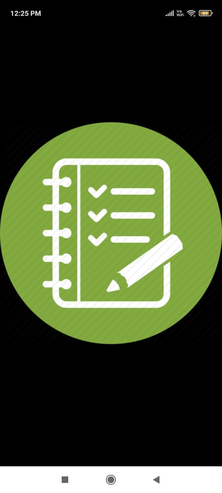</a> <a href="pics/n2.jpeg">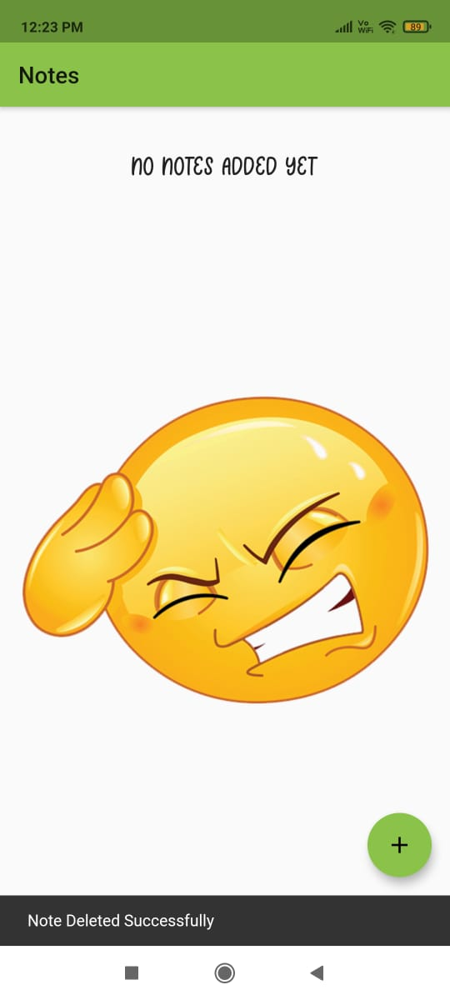</a> <a href="pics/n3.jpeg">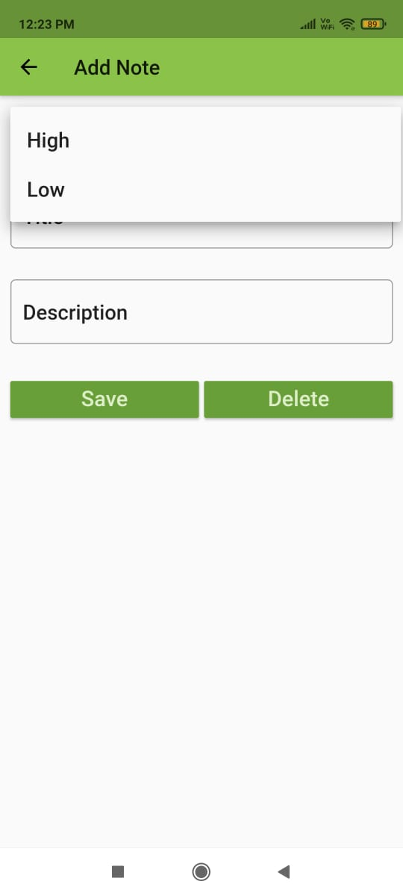</a>

<a href="pics/n4.jpeg">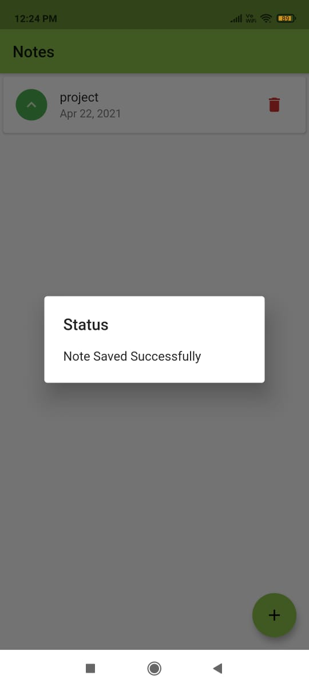</a> <a href="pics/n8.jpeg">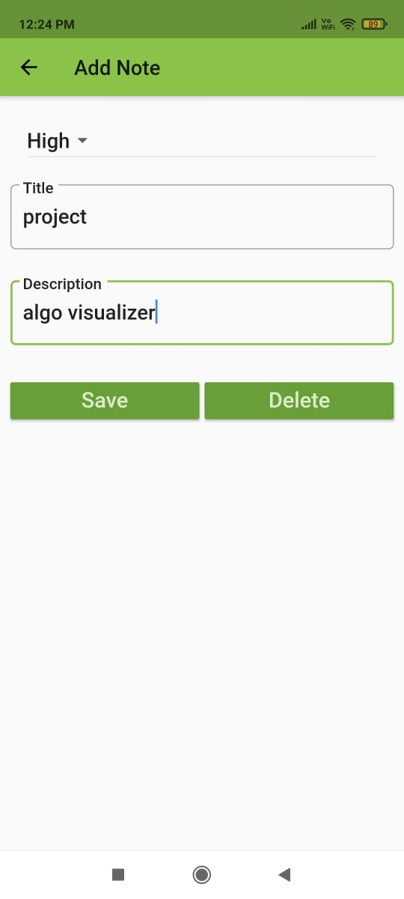</a> <a href="pics/n13.jpeg">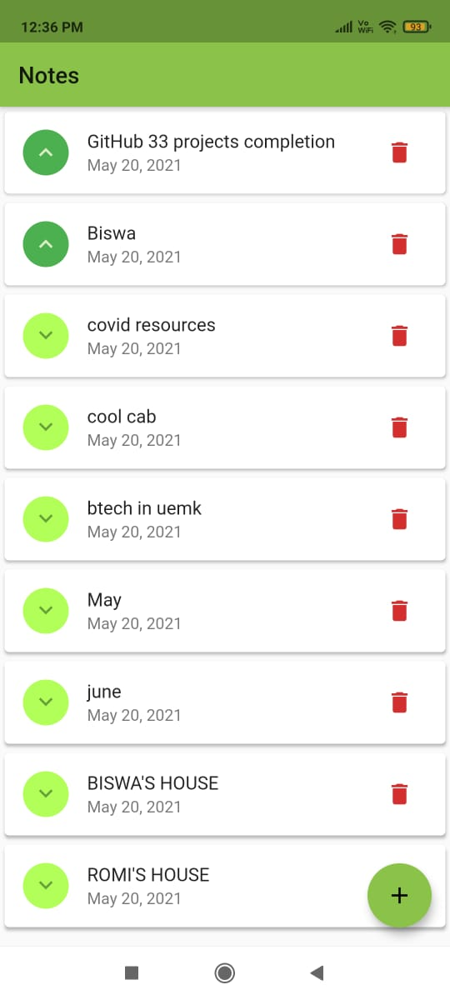</a>

<a href="pics/n6.jpeg">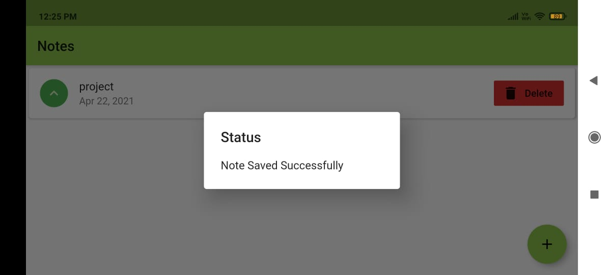</a> <a href="pics/n7.jpeg">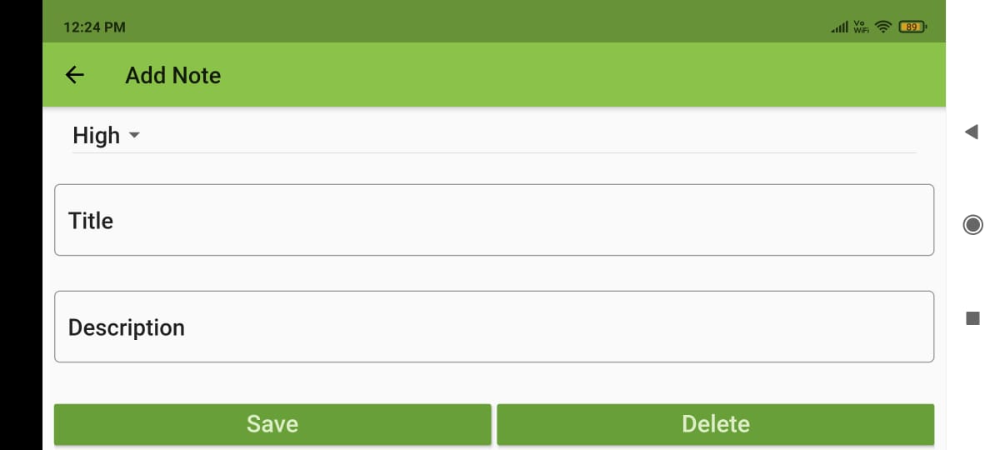</a>

<a href="pics/n9.jpeg">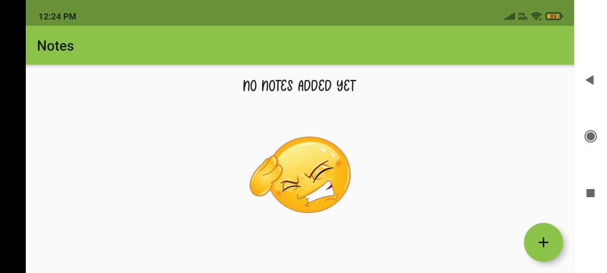</a> <a href="pics/n10.jpeg">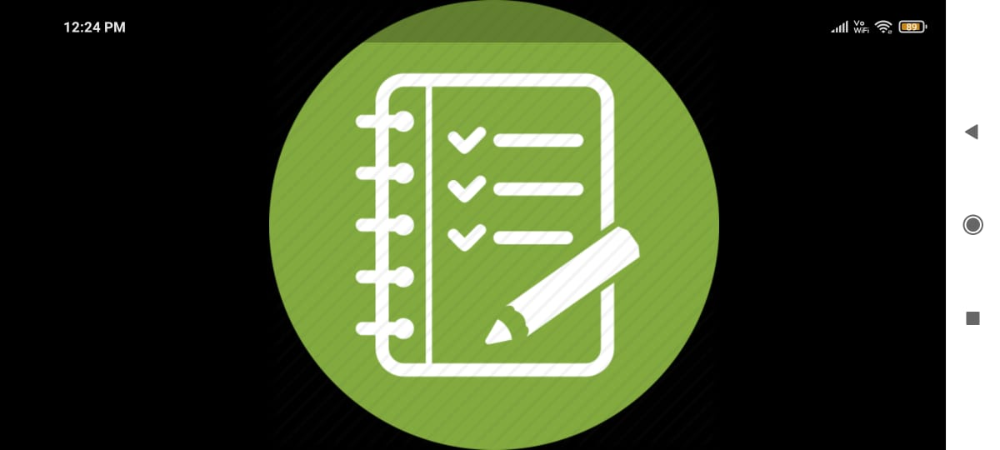</a>

<a href="pics/n11.jpeg">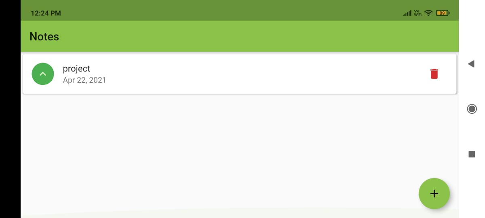</a> <a href="pics/n12.jpeg">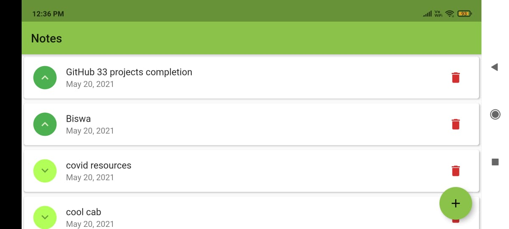</a>

</div>


